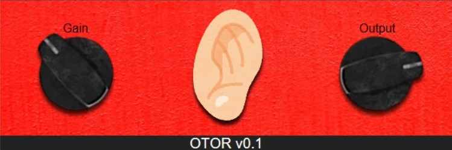

# otor_vst

  

The prototype of OTOR, which is Otoware Meister, are published below.  
[https://github.com/ippee/otoware_meister_vst](https://github.com/ippee/otoware_meister_vst)  

  

## What Is OTOR?
**OTOR** is a distortion VST plugin which specializes in generating earrape sounds.  
The name of OTOR comes from the Japanese word "otoware (音割れ)", which means "earrape" in English.  

Because a recent DAW audio engine processes a signal by 64 bit floating point, it is never clipped before it is sent to the D/A converter. However, that means that it is difficult to generate earrape sounds in DAW.  

Thus, to solve this problem, I developed OTOR.  

OTOR can amplify a signal up to 150 dB, but this plugin chops the amplified signal at 0 dBFS forcibly. By doing this, OTOR gives you fierce distorted sounds.  

## Progress
The basic function of OTOR is already completed, so now I'm developing GUI.  
If it's done also, I will publish OTOR formally.  

At the moment, OTOR supports **Windows OS only**.  

I want to develop the Mac OS version, but its outlook does not stand at all. If I should receive many requests for this, I would plan something like a crowdfunding campaign.  

## WARNING!
**EARRAPE SOUNDS MAY DAMAGE YOUR EARS AS WELL AS YOUR AUDIO EQUIPMENT.**  
**PLEASE NOTE THAT I DO NOT TAKE ANY RESPONSIBILITY OR LIABILITY FOR ANY DAMAGE OR LOSS CAUSED THROUGH THIS PLUGIN.**  

## License
Licensed under either of

- Apache License, Version 2.0, ([LICENSE_Apache](https://github.com/ippee/otoware_meister_vst/blob/master/LICENSE_Apache) or http://www.apache.org/licenses/LICENSE-2.0)
- MIT license ([LICENSE_MIT](https://github.com/ippee/otoware_meister_vst/blob/master/LICENSE_MIT) or http://opensource.org/licenses/MIT)

at your option.  

### Contribution
Unless you explicitly state otherwise, any contribution intentionally submitted for inclusion in the work by you, as defined in the Apache-2.0 license, shall be dual licensed as above, without any additional terms or conditions.  

## Using Sources
### Programming Language
- [Rust](https://github.com/rust-lang/rust) (1.42.0)

### Crates (Libraries)
- [vst-rs](https://github.com/RustAudio/vst-rs) (0.2.0)
- [rust-vst-gui](https://github.com/ippee/rust-vst-gui.git)
  - This is a fork of [mikesoylu / rust-vst-gui](https://github.com/mikesoylu/rust-vst-gui)
  - The origin of them is [vanderlokken / rust-vst-gui](https://github.com/vanderlokken/rust-vst-gui)
- [lazy_static](https://github.com/rust-lang-nursery/lazy-static.rs) (1.4.0)
- [input-knobs](https://github.com/g200kg/input-knobs)

### Images
- [DIAL_NASTY_-_01.knob](https://www.g200kg.com/en/webknobman/gallery.php?m=p&p=1679) by MFS AKA ©2020
- [red textile in close up image photo – Free Red Image on Unsplash](https://unsplash.com/photos/NRTYIVUkKnM?utm_source=twitter&utm_medium=referral&utm_content=photos-page-share) by Andrew Buchanan
- [耳のイラスト](https://www.irasutoya.com/2014/05/blog-post_6517.html) by Illust-ya (いらすとや)